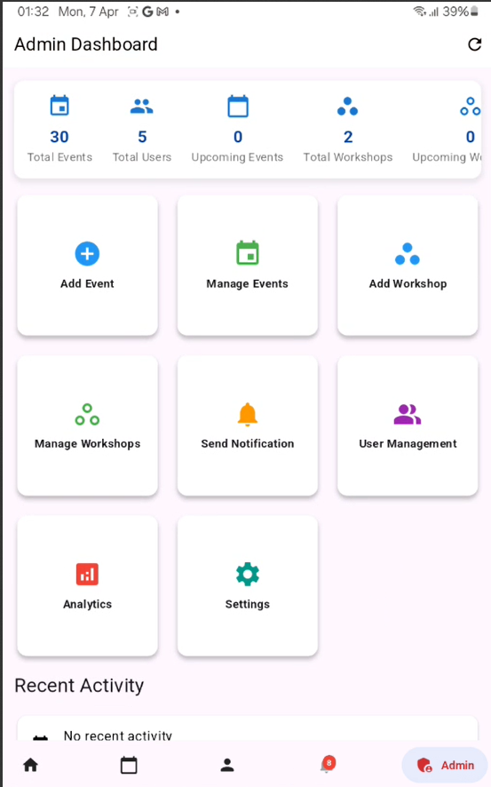
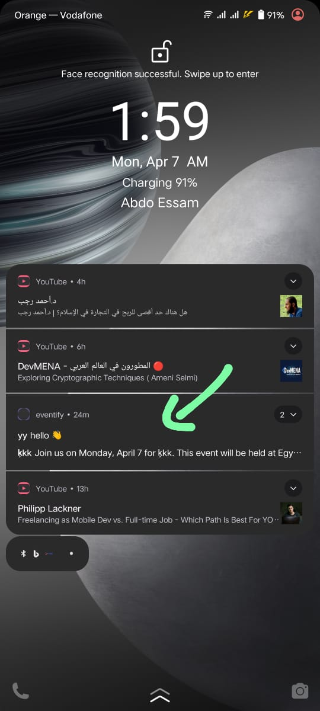

# Eventify

Eventify is a modern, feature-rich event management application built with Flutter, implementing Clean Architecture principles for robust, maintainable, and scalable code. The application helps users organize, manage, and participate in events and workshops with a seamless user experience.

## 🌟 Features

### Core Features
- **Event Management**
  - Create and manage events
  - Calendar integration
  - Real-time updates
  - Event categories and filtering
  - Location mapping
  - Event sharing

### User Features
- **Authentication & Authorization**
  - Email/password authentication
  - Google Sign-in
  - Role-based access control
  
- **Profile Management**
  - User profiles
  - Event history
  - Bookmarked events
  
- **Notifications**
  - Push notifications
  - Event reminders
  - Updates and changes

### Additional Features
- **Multi-language Support**
  - Multiple language options
  - RTL support
- **Theme Customization**
  - Light/Dark mode
  - Dynamic theming
- **Offline Support**
  - Local data caching
  - Offline event viewing

## 🏗 Architecture

The project follows Clean Architecture principles with three main layers:

### 1. Domain Layer (`lib/domain/`)
- Business logic and rules
- Use cases
- Entity definitions
- Repository interfaces

### 2. Data Layer (`lib/data/`)
- Repository implementations
- Data sources (Remote/Local)
- Data models
- API clients

### 3. Presentation Layer (`lib/presentation/`)
- UI components
- State management
- Pages and widgets
- Theme and styling

## 🛠 Technical Stack

### Frontend
- **Framework**: Flutter 3.x
- **Language**: Dart 3.6.0+
- **State Management**: 
  - Provider (for app-wide state)
  - Bloc/Cubit (for feature-specific state)

### Backend Services
- **Firebase**
  - Authentication
  - Cloud Firestore
  - Cloud Storage
  - Cloud Messaging (FCM)
  - Analytics
- **Supabase**
  - Real-time Database
  - Authentication
  - Storage

### Major Dependencies
- **UI/UX**
  - `flutter_staggered_animations`
  - `cached_network_image`
  - `shimmer`
  - `flutter_animate`
  - `salomon_bottom_bar`
  - `carousel_slider`

- **Charts & Visualization**
  - `fl_chart`
  - `charts_flutter`

- **Functionality**
  - `table_calendar`
  - `image_picker`
  - `share_plus`
  - `url_launcher`
  - `webview_flutter`

- **Local Storage & Notifications**
  - `shared_preferences`
  - `flutter_local_notifications`

## 🚀 Getting Started

### Prerequisites
- Flutter SDK (3.x or higher)
- Dart SDK (3.6.0 or higher)
- Android Studio / VS Code
- Firebase project
- Supabase project

### Installation

1. **Clone the repository**
   ```bash
   git clone https://github.com/yourusername/eventify.git
   cd eventify
   ```

2. **Install dependencies**
   ```bash
   flutter pub get
   ```

3. **Configure Firebase**
   - Create a Firebase project
   - Add your `google-services.json` (Android) and `GoogleService-Info.plist` (iOS)
   - Configure Firebase options in `lib/firebase_options.dart`

4. **Configure Supabase**
   - Create a Supabase project
   - Add your Supabase URL and anon key to environment variables

5. **Run the app**
   ```bash
   flutter run
   ```

## 🔧 Configuration

### Environment Variables
Create a `.env` file in the root directory:

## 🎥 Admin Dashboard Preview

Here’s a quick preview of the Admin Dashboard functionality:

[](https://github.com/M0hamed-Eid/eventify/blob/master/assets/admin.mp4)

---

## 🛎️ User Notifications

Whenever a new event is created, a notification is automatically sent to all users.  
Admins can also create and send **custom notifications** from the dashboard.


